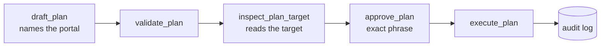

# ManyPortals MCP

[](LICENSE) [](https://github.com/hohguy/manyportals-mcp/actions/workflows/ci.yml) 

**One AI assistant. Many HubSpot portals. Every write names its portal.**

Keeping the content of records apart is a matter of how you use the assistant: see [SAFETY](docs/SAFETY.md).

ManyPortals is a self-hosted [Model Context Protocol](https://modelcontextprotocol.io) (MCP) server that holds credentials for several HubSpot portals at once.

> [!IMPORTANT]
> Validate it against your own portals before you enable writes: the first calls to live HubSpot happen at a [portal check](docs/GO-LIVE.md) you run yourself.

## Quick setup

This connects **one portal, read-only**, to Claude Desktop. Writes, more portals and the encrypted vault are in [USAGE](docs/USAGE.md). You need Claude Desktop, and in the HubSpot portal either Super Admin or the Developer tools access permission.

**1. Create a Service Key** in HubSpot: **Development → Keys → Service keys → Create service key**. Select only the scopes for the objects you will use, from the [scope table](docs/USAGE.md#scopes). The key starts with `pat-`.

**2. Find the hub ID.** Click your account name in the upper right of HubSpot. It is under **Account**, and it is also the number in HubSpot URLs, as in `app.hubspot.com/contacts/123456789/`.

**3. Create the folder and write `~/.manyportals/config.json`** (`mkdir -p ~/.manyportals && chmod 700 ~/.manyportals`)**:**

```json
{
  "portals": {
    "PORTAL_A": {
      "expectedHubId": 123456789,
      "label": "Example Co",
      "allowWrite": false
    }
  }
}
```

`PORTAL_A` is a short name you choose, such as `ACME` or `eu-ops`. You use it in tool calls.

**4. Write `~/.manyportals/tokens.json`,** then restrict it:

```json
{ "PORTAL_A": "pat-..." }
```

```sh
chmod 600 ~/.manyportals/tokens.json
```

**5. Install the extension.** Download `manyportals-mcp.mcpb` from the [latest release](https://github.com/hohguy/manyportals-mcp/releases/latest) and open it. Set **Portal config file** to the full path of your `config.json`, and leave **Vault passphrase** empty.

**6. Restart Claude Desktop.** Then try:

> List my configured portals, then show recent deal activity in PORTAL_A.

### Other ways to run it

- **From source, any MCP client:** clone, `npm ci && npm run build`, point the client at `dist/index.js`. See [USAGE](docs/USAGE.md#connect-it-to-claude). `npm ci` installs exactly the locked dependency set, so your tree matches the one that was tested. Every release is tagged `vX.Y.Z`. `main` carries the latest release plus any documentation fixes made since it, so check out the release tag if you need exactly what a release shipped.
- **Claude Code:** build from source, then `claude mcp add`. Same section of USAGE.

## The tools

| Tool                                                                                    | Kind               | Portal                              |
| --------------------------------------------------------------------------------------- | ------------------ | ----------------------------------- |
| `list_portals`, `set_default_read_portal`                                               | read               | not needed                          |
| `get_record`, `search_records`, `recent_activity`, `summarize_pipeline`                 | read               | explicit, else the selected default |
| `draft_plan`, `add_note`, `create_task`, `log_call`, `log_meeting`, `update_deal_stage` | start a write      | explicit, always                    |
| `validate_plan`, `inspect_plan_target`, `show_plan`, `approve_plan`, `execute_plan`     | continue a write   | from the plan                       |
| `get_audit_log`                                                                         | read the audit log | optional filter                     |

The record-reading tools carry the MCP `readOnlyHint` annotation, and `approve_plan` and `execute_plan` carry `destructiveHint`, so a client can treat them differently. `set_default_read_portal` carries neither: it reads nothing from HubSpot but it does change which portal later reads default to. [USAGE](docs/USAGE.md#the-tools) describes each one.

## How a write happens



In `apply` mode the approval step is replaced, for the object types you list, by a standing per-portal allow list. Draft and validate still run. The target-inspection step runs when the write touches an existing record or sets a pipeline or stage, which for a plain create is neither, so an auto-executed note is not read back against the portal first.

## How writes are kept to the right portal

- **No direct write tool.** Every change runs the steps above, and each step is recorded. The assistant issues each call, including the approval, so what keeps a change from being committed on its own is that your client asks you before the steps marked destructive. See [SAFETY](docs/SAFETY.md).
- **Writes name their portal.** When a write touches an existing record, that record is read in the named portal first, so you can confirm it before the change is saved.
- **Default-deny.** Each portal allows only the object types and operations you list.
- **Startup check.** Each token must report the hub ID you configured, which catches a swapped token.
- **Token values stay out of results.** They are not included in tool results, logs, or error messages.

> [!WARNING]
> ManyPortals does not attempt to detect or neutralise prompt injection in CRM content. Text inside a record can try to steer an assistant into actions you did not intend. The checks above govern where a write goes, not what the content says. Keep approval a human step, and connect only portals whose content you trust. [SAFETY](docs/SAFETY.md) sets out the limits in full.

## Where your data goes

The server sends API requests directly to HubSpot and runs no hosted intermediary, so there is no central store of several businesses' tokens to breach. Your AI client is separate: the records it reads are sent to whichever provider runs that assistant, which is outside this server's control.

## Scope

**Included:** portal routing, read tools, the write lifecycle with named drafts such as `add_note` and `update_deal_stage`, per-portal allow lists, an append-only audit log, an encrypted token vault, and the `doctor` and `check-portals` commands. Targets HubSpot's 2026-03 API.

**Not included:** a hosted or multi-tenant mode, moving records between portals, analytics, and deleting or archiving records.

## Requirements

- **Claude Desktop** for the extension, or **Node.js 22 or newer** to run from source and to use `doctor` and `check-portals`.
- **One HubSpot Service Key per portal.** Creating one needs Super Admin or the Developer tools access permission in that portal, and a key carries only scopes its creator holds.
- **An existing private-app token also works.** HubSpot ends the creation of new private apps in 2026, which is why new setups use a Service Key.

## Help, security, contributing

- Questions and bugs: [SUPPORT](docs/SUPPORT.md).
- Security problems: report them privately, as described in [SECURITY](SECURITY.md). Not as a public issue.
- Patches and the review bar: [CONTRIBUTING](CONTRIBUTING.md).

## License

MIT. Built on [shinzo-labs/hubspot-mcp](https://github.com/shinzo-labs/hubspot-mcp), also MIT: the HubSpot request shapes were adapted from it, and the multi-portal routing, the write lifecycle, the safety checks and the audit log are new. See [NOTICE](NOTICE).

Not affiliated with or endorsed by HubSpot, Inc. "HubSpot" is a trademark of HubSpot, Inc.
